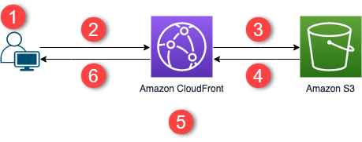

# spa-cdk-deploy
Deploy a single page web app to AWS using the Go CDK.

This assumes you have a domain name already registered, which will need to be entered in cdk.go.

[Architecture overview](https://docs.aws.amazon.com/AmazonCloudFront/latest/DeveloperGuide/getting-started-secure-static-website-cloudformation-template.html)

Inspired by: https://www.youtube.com/watch?v=2DzEF3deOLw

# Welcome to your CDK Go project!

The `cdk.json` file tells the CDK toolkit how to execute your app.

## Useful commands

* `cdk deploy`      deploy this stack to your default AWS account/region
* `cdk diff`        compare deployed stack with current state
* `cdk synth`       emits the synthesized CloudFormation template
* `go test`         run unit tests
